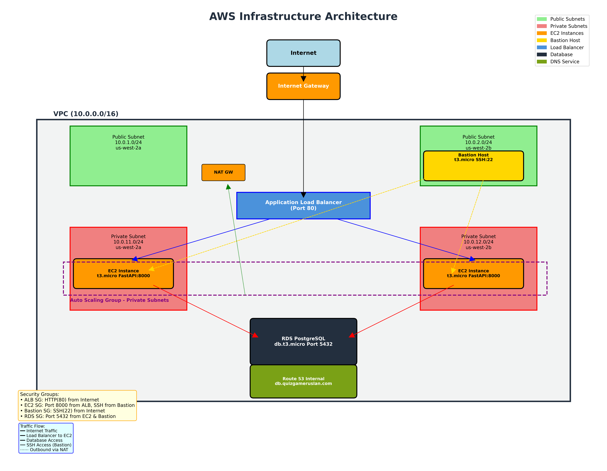

# AWS Terraform Project ☁️

This project sets up a full AWS infrastructure using Terraform to deploy a FastAPI application on EC2 instances behind an Application Load Balancer (ALB), with Auto Scaling and a PostgreSQL RDS database.

---

## 🔧 Project Structure

* `vpc.tf` — VPC, public and private subnets, internet gateway, NAT gateway, and route tables
* `security_groups.tf` — Security groups for ALB, EC2 instances, bastion host, and RDS
* `bastion.tf` — Bastion host EC2 instance for secure SSH access to private instances
* `launch_template.tf` — EC2 launch template (AMI, instance type, EBS volume, user\_data script)
* `alb.tf` — Application Load Balancer (ALB), target group, and HTTP listener
* `autoscaling.tf` — Auto Scaling Group with two EC2 instances
* `rds.tf` — RDS PostgreSQL instance in private subnets
* `scripts/ec2_user_data.sh` — User data script that configures the EC2 instances and starts the FastAPI app
* `outputs.tf` *(optional)* — Outputs like ALB DNS name and RDS endpoint

---

## ⚙️ Requirements

* Terraform `>= 1.0`
* AWS CLI configured (`aws configure` or env vars `AWS_ACCESS_KEY_ID`, `AWS_SECRET_ACCESS_KEY`, `AWS_DEFAULT_REGION`)
* An existing EC2 KeyPair (referenced in `variables.tf`)

---

## ✨ Quick Start

1. **Initialize Terraform**

```bash
terraform init
```

2. **Preview the plan**

```bash
terraform plan
```

3. **Apply the infrastructure**

```bash
terraform apply
```

4. **Validate setup**

   * Go to AWS Console to check:

     * VPC, subnets, IGW/NAT
     * Security Groups for ALB and EC2
     * 2 EC2 instances in Auto Scaling Group
     * ALB status and port 80 listener
     * PostgreSQL RDS in private subnet
   * Test FastAPI:

```bash
curl http://<ALB-DNS>/health
```

Expected output:

```json
{"status": "ok"}
```

---

## 📃 Common Commands

```bash
# SSH to bastion host (jump server)
ssh -i path/to/key.pem ec2-user@<BASTION-PUBLIC-IP>

# From bastion, SSH to private EC2 instances
ssh -i path/to/key.pem ec2-user@<PRIVATE-EC2-IP>

# Check if FastAPI is up
curl http://<ALB-DNS>/health

# Connect to PostgreSQL from EC2 or bastion
psql -h <RDS-ENDPOINT> -U postgres -d postgres -p 5432
```

---

## ⚙️ Variables and Configuration

The `variables.tf` file contains required variables:

```hcl
variable "key_pair" { type = string }
```

Set your key name in `terraform.tfvars`:

```hcl
key_pair = "your-ec2-keypair"
```

Other resources (VPC, subnets, etc.) use hardcoded defaults. You can change them as needed.

---

## 🔧 Features

* **Enhanced Security**: EC2 instances in private subnets, no direct internet access
* **Bastion Host**: Secure SSH access via jump server in public subnet
* Auto Scaling Group ensures exactly **2 EC2 instances** always run in private subnets
* ALB provides a **single entry point** and balances traffic to private EC2s
* FastAPI app is deployed using a `user_data` script
* PostgreSQL RDS is hosted in private subnets for security
* **NAT Gateway**: Enables private instances to access internet for updates
* DNS aliasing via Route 53 for easy access to the database

---

## 📄 Teardown

To destroy all created resources:

```bash
terraform destroy
```

---

## 🏗️ Infrastructure Overview

This project provisions the following AWS resources using Terraform:

### 1. **Networking (VPC)**

- **VPC** with CIDR `10.0.0.0/16`
- **Public Subnets**: 2 subnets in different Availability Zones (AZs)
  - `10.0.1.0/24` in `us-west-2a`
  - `10.0.2.0/24` in `us-west-2b`
- **Private Subnets**: 2 subnets in different AZs
  - `10.0.11.0/24` and `10.0.12.0/24`
- **Internet Gateway (IGW)** for public subnet outbound traffic
- **NAT Gateway** in a public subnet to allow private subnets outbound internet access
- **Route Tables** to route public and private traffic accordingly

### 2. **Security Groups**

- **ALB Security Group** allowing inbound HTTP (port 80) from internet
- **EC2 Security Group** allowing traffic from ALB (port 8000) and SSH from bastion (port 22)
- **Bastion Security Group** allowing SSH (port 22) from internet
- **RDS Security Group** allowing access from EC2 instances and bastion (port 5432)

### 3. **Compute**

- **Launch Template** defining EC2 instance settings (AMI, instance type `t3.micro`, volume, user\_data)
- **Auto Scaling Group (ASG)** that always maintains 2 EC2 instances in private subnets (1 in each AZ)
- **Bastion Host** EC2 instance (`t3.micro`) in public subnet for secure SSH access
- **User Data Script** installs FastAPI, pulls your GitHub repo, sets up environment, and runs Uvicorn

### 4. **Load Balancing**

- **Application Load Balancer (ALB)**:
  - Distributes traffic across the EC2 instances
  - Listens on port 80
  - Performs health checks on `/health`
- **Target Group** associated with the ALB for private EC2 targets on port 8000

### 5. **Database**

- **Amazon RDS** PostgreSQL instance:
  - Engine: PostgreSQL (e.g. version 15.4)
  - Instance class: `db.t3.micro`
  - 20 GB gp2 storage
  - Deployed in private subnets
  - Only accessible from EC2 instances and bastion host

### 6. **DNS**

- **Route 53 Hosted Zone**:
  - Custom domain (e.g. `quizgameruslan.com`)
  - CNAME record pointing `db.quizgameruslan.com` to RDS endpoint

Ensure sensitive data (like `.pem` keys or credentials) is never committed.

## 🔐 SSH Access Setup

### Step 1: Connect to Bastion Host
```bash
ssh -i path/to/your-key.pem ec2-user@<BASTION_PUBLIC_IP>
```

### Step 2: Copy SSH Key to Bastion (One-time setup)
```bash
scp -i path/to/your-key.pem path/to/your-key.pem ec2-user@<BASTION_PUBLIC_IP>:~/.ssh/
```

### Step 3: From Bastion, SSH to Private EC2 Instances
```bash
ssh -i ~/.ssh/your-key.pem ec2-user@<PRIVATE_EC2_IP>
```

### Alternative: SSH Tunneling (Advanced)
```bash
# Direct SSH to private instance via bastion
ssh -i path/to/your-key.pem -J ec2-user@<BASTION_PUBLIC_IP> ec2-user@<PRIVATE_EC2_IP>
```


---

## 💰 Estimated Monthly and Annual Costs

| Resource                     | Quantity    | Monthly Estimate | Notes                                                            |
| ---------------------------- | ----------- | ---------------- | ---------------------------------------------------------------- |
| EC2 `t3.micro` (Private)     | 2 instances | \~\$16.70        | On-demand, 750 hours each (\~\$8.35/month/instance in us-west-2) |
| EC2 `t3.micro` (Bastion)     | 1 instance  | \~\$8.35         | Bastion host in public subnet                                    |
| Auto Scaling Group           | included    | –                | No extra cost beyond EC2 usage                                   |
| Application Load Balancer    | 1 ALB       | \~\$18.00        | Includes \~730 hours + minimal data processed                    |
| RDS PostgreSQL `db.t3.micro` | 1 instance  | \~\$15.00        | 20 GB gp2, no Multi-AZ                                           |
| EBS gp2 for EC2              | 3 volumes   | \~\$3.00         | \~\$0.10/GB (20GB each)                                          |
| NAT Gateway                  | 1 gateway   | \~\$32.40        | \$0.045/hour + small data processing                             |
| Route 53 (hosted zone)       | 1 zone      | \~\$0.50         | \$0.50/month/zone                                                |
| **Total Monthly**            | –           | **\~\$93.95**    | May vary based on usage and region                               |
| **Total Annual**             | –           | **\~\$1,127.40** | Excludes data transfer costs                                     |

> 💡 **Note**: This is a simplified estimation based on AWS On-Demand pricing in the `us-west-2` region. Prices may vary based on actual usage, data transfer, and region. Use [AWS Pricing Calculator](https://calculator.aws.amazon.com) for more precise estimates.

---

## 📢 Contact

For questions or feedback, open an issue in this repository.

---

Happy deploying ✨
